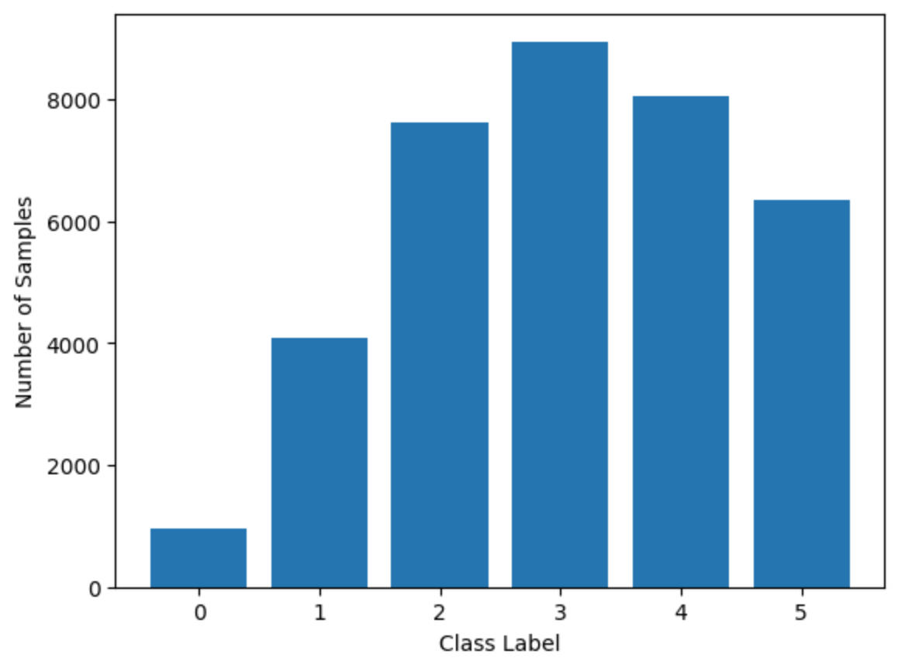

# AWS Machine Learning Engineer Nanodegree

## Capstone Project - Inventory Monitoring at Distribution Centers

Yue Chang

Mar 6th, 2023

## I. Definition

### Project Overview

The retail industry has been rapidly advancing, with increasing use of automation and machine learning in various aspects of operations. One such area is the optimization of product storage and retrieval in warehouses, which is critical for efficient order distribution. In this context, the Amazon Bin Image Dataset provides a valuable resource for exploring machine learning solutions to object counting and identification within bins.

The objective of this project is to develop a scalable and fast cloud-based solution for counting objects in images of bins using machine learning algorithms. The Amazon Bin Image Dataset is used, which contains over 500,000 images of bins containing objects of various types and sizes. The project aims to demonstrate how machine learning algorithms, specifically using Amazon SageMaker, can be used to automate object counting tasks in the context of Amazon's distribution centers. By automating this process, the goal is to reduce the time and error associated with manual counting of objects.

### Problem Statement

The goal of this project is to develop an end-to-end cloud-based machine learning solution to accurately count the number of objects in images of bins using the Amazon Bin Image dataset. The dataset consists of images of bins containing objects of various types and sizes, and the task is to classify the number of objects in each bin.

To achieve this goal, the following tasks will be undertaken:

- **Dataset preparation**: Extracting a subset of the Amazon Bin Image dataset with classes ranging from 0 to 5 using a SageMaker processing job.
- **Hyperparameters tuning**: Using a SageMaker hyperparameters tuner to find the optimal values of the learning rate and batch size for training.
- **Model training**: Using PyTorch with transfer learning and the ResNet50 architecture, train a model to accurately count the number of objects in images of bins. SageMaker profiler and debugger will be used to monitor the training process and ensure that the model is performing as expected.
- **Model evaluation**: Using a SageMaker batch transform to evaluate the performance of the trained model on a test set using appropriate metrics such as accuracy and RMSE.
- **Model deployment**: Deploying the trained model to a SageMaker endpoint to be used for object counting tasks in a production environment.

The anticipated solution is an accurate and efficient model that can automate object counting tasks in the context of Amazon's distribution centers, reducing the time and error associated with manual counting of objects. SageMaker will be used to developing a scalable and fast cloud-based end-to-end solution for a machine learning pipeline, this project aims to demonstrate the power and flexibility of cloud-based machine learning solutions.

### Metrics

For this object counting problem, `accuracy` and `root mean square error (RMSE)` as evaluation metrics.

Accuracy is a common metric used in classification tasks, as it provides a clear indication of how well the model is able to predict the correct label. In this project, the goal is to accurately count the number of objects in each bin, which is a classification problem. Therefore, accuracy is a natural choice for evaluating the performance of the model.

Accuracy measures the proportion of correctly predicted object counts to the total number of object counts in the validation/test set. It is computed as:

`accuracy = correct predictions / total predictions`

where `correct predictions` refer to the number of images where the predicted count matches the true count, and `total predictions` refer to the total number of images in the validation/test set.

RMSE is a widely used metric in regression tasks, as it measures the distance between the predicted values and the true values. In this project, we are predicting the count of objects in each bin, RMSE provides a measure of the average difference between the predicted and true counts, which is a useful metric for evaluating the overall accuracy of the model's count predictions.

RMSE measures the average difference between the predicted and true counts. It is computed as:

`RMSE = sqrt(sum((predicted_count - true_count)^2) / n)`

where `predicted_count` and `true_count` are the predicted and true counts for each image, respectively, and `n` is the total number of images in the validation/test set.

## II. Analysis

### Data Exploration

The Amazon Bin Image Dataset is a collection of images of Amazon fulfillment center bins, which are used to store and transport products within Amazon warehouses. The dataset was released by Amazon Robotics and contains 535,234 images of bins, with each image labeled according to the items it contains [[1]].

The sizes of the bins vary depending on the size of the objects inside them, and there are tapes in front of the bins to prevent items from falling out. However, the tapes can sometimes obstruct the view of the objects in the images. Additionally, the objects in the images can be heavily occluded by other objects or limited by the viewpoint of the images, making object counting a challenging task. Here are some sample images from the dataset:


*Fig 1. Sample Images from Amazon Bin Image Datasets*

The dataset also includes metadata about the products in the bins, such as their names, Amazon Standard Identification Number (ASIN), dimensions, weights, and quantities. Below is an example of image(jpg) and metadata(json) pair. This image contains 3 different object categories. For each category, there is one instance. So, "EXPECTED_QUANTITY" is 3, and for each object category "quantity" field was 1. Unique identifier("asin") is assigned to each object category, e.g. here "B00CFQWRPS", "B00T0BUKW8", and "B00C3WXJHY" [[2]]. Since the project goal is object counting, we will be using only the number of objects "EXPECTED_QUANTITY" present in each image's metadata file as our ground truth label.


*Fig 2. Image with Metadata*


```
{
    "BIN_FCSKU_DATA": {
        "B00CFQWRPS": {
            "asin": "B00CFQWRPS",
            "height": {
                "unit": "IN",
                "value": 2.399999997552
            },
            "length": {
                "unit": "IN",
                "value": 8.199999991636
            },
            "name": "Fleet Saline Enema, 7.8 Ounce (Pack of 3)",
            "normalizedName": "(Pack of 3) Fleet Saline Enema, 7.8 Ounce",
            "quantity": 1,
            "weight": {
                "unit": "pounds",
                "value": 1.8999999999999997
            },
            "width": {
                "unit": "IN",
                "value": 7.199999992656
            }
        },
        "ZZXI0WUSIB": {
            "asin": "B00T0BUKW8",
            "height": {
                "unit": "IN",
                "value": 3.99999999592
            },
            "length": {
                "unit": "IN",
                "value": 7.899999991942001
            },
            "name": "Kirkland Signature Premium Chunk Chicken Breast Packed in Water, 12.5 Ounce, 6 Count",
            "normalizedName": "Kirkland Signature Premium Chunk Chicken Breast Packed in Water, 12.5 Ounce, 6 Count",
            "quantity": 1,
            "weight": {
                "unit": "pounds",
                "value": 5.7
            },
            "width": {
                "unit": "IN",
                "value": 6.49999999337
            }
        },
        "ZZXVVS669V": {
            "asin": "B00C3WXJHY",
            "height": {
                "unit": "IN",
                "value": 4.330708657
            },
            "length": {
                "unit": "IN",
                "value": 11.1417322721
            },
            "name": "Play-Doh Sweet Shoppe Ice Cream Sundae Cart Playset",
            "normalizedName": "Play-Doh Sweet Shoppe Ice Cream Sundae Cart Playset",
            "quantity": 1,
            "weight": {
                "unit": "pounds",
                "value": 1.4109440759087915
            },
            "width": {
                "unit": "IN",
                "value": 9.448818888
            }
        }
    },
    "EXPECTED_QUANTITY": 3
}
```

### Exploratory Visualization

Table 1 presents the basic statistics: the total number of images, the average quantity of objects per bin, and the total number of object categories of the Amazon Bin Image Dataset. With over 500,000 images, this dataset is massive, and selecting a small subset of it will be necessary due to budget constraints for Amazon Web Services. The table displays the total number of images, the average quantity of objects per bin, and the total number of object categories in the dataset.

| Description                   | Total    |
|-------------------------------|--------:|
| The number of images          | 535,234 |
| Average quantity in a bin     |     5.1 |
| The number of object categories | 459,476 |

*Table 1. Amazon Bin Image Dataset Statistics*

Object Quantity distribution is shown in Fig 3, which reveals that 90% of bin images contain less than 10 object instances in a bin. Additionally, the class distribution is imbalanced, which can pose a challenge for the object counting image classification task. Consequently, addressing this issue will require special attention when developing our algorithm and preprocessing the data.


*Fig 3. Quantity Distribution of Amazon Bin Image Dataset*

Furthermore, Figure 4 displays the distribution of object repetition in the dataset, where it is evident that 164,255 object categories appear only once in the entire dataset, while 164,356 object categories occur twice. This means that over 71% of data contain unique objects, making the dataset highly diverse and challenging for our object counting task.


*Fig 4. Object Repetition Distribution of Amazon Bin Image Dataset*

### Algorithms and Techniques

In this project, we intend to use transfer learning to improve the accuracy of our object counting model. Specifically, we plan to utilize the ResNet50 model as our base model and fine-tune it on the Amazon Bin Image Dataset using PyTorch and Amazon SageMaker PyTorch training.

We have chosen transfer learning because it has proven to be effective in improving the performance of models on image classification tasks, especially when the available training data is limited. By using a pre-trained model as a starting point, we can leverage its learned features and adapt them to our specific problem domain, which can reduce training time and improve accuracy.

To optimize the performance of our model, we will also launch a hyperparameter tuning job using Amazon SageMaker Hyperparameters Tuner. We will tune the learning rate (lr) and batch size (batch_size) hyperparameters to find the best combination that yields the highest accuracy. Once the tuning job is complete, we will use the best hyperparameters found for training our model.

To access the dataset, the boto3 library in Python was used to interact with the S3 bucket. In this project, the SageMaker Processing Job was used to perform ETL (Extract, Transform, and Load) on the dataset. Since the Amazon Bin Image Dataset is quite large, this project will be use a subset of the data to conserve AWS costs.

One challenge that is mentioned before in data exploration section is the class imbalance present in the dataset. To address this issue, we will use several techniques. First, we will use a weighted sampler during training to ensure that each class is represented equally. Second, we will adjust the scheduler and optimizer to account for class imbalance. Third, we will use a criterion weight tensor to weight the loss function and give more weight to underrepresented classes.

By using these techniques and algorithms, we aim to address the class imbalance issue and improve the accuracy of our object counting solution.

### Benchmark

In this project, the benchmark model that we will use to compare the performance of our proposed solution is an open accessible model that can be downloaded from [here](http://www.cs.unc.edu/~eunbyung/abidc/resnet34_best.pth.tar). The benchmark model is a deep convolutional classification network that uses the ResNet-34 architecture and is trained from scratch on the Amazon Bin Image Dataset. The model is trained to classify each image into one of six categories (0-5), representing the number of objects in each bin. The training script runs for 40 epochs with a batch size of 128, and the learning rate is decayed by a factor of 0.1 every 10 epochs.

During training, the model achieved a best validation accuracy of 55.67% and an RMSE of 0.930 at 21 epochs. However, after 21 epochs, the model starts to overfit. The metadata format used for both the training and validation set is a list of [image idx, count] pairs.

The benchmark model's accuracy, RMSE, per-class accuracy, and RMSE are provided for comparison with our proposed solution. By comparing the performance of our proposed solution with that of the benchmark model, we can evaluate the effectiveness of our approach.

## III. Methodology

### Data Preprocessing

Data preprocessing is a critical aspect of any machine learning project, particularly when dealing with large and complex datasets. In this project, we encounter a massive dataset and must extract a representative subset of data for our task. Moreover, the ground truth labels are embedded in the metafile `EXPECTED_QUANTITY` key, and we must extract this information as well. To this end, we employ AWS Sagemaker processing job, which allows us to efficiently and effectively extract the relevant data. Specifically, we download a subset list from [here](http://www.cs.unc.edu/~eunbyung/abidc/random_val.txt) and iterate through it to extract each ground truth label and its corresponding image file name. We only consider data with labels from 0-5 to ensure a fair comparison with our benchmark solution. The extracted data is then stored in a dictionary, where the key corresponds to the label (0-5), and the value is a list of image file names. Finally, we save the dictionary as a JSON file in S3 for future use.


*Fig 5. SageMaker Processing Job*


*Fig 6. SageMaker Processing Job Output*

Subsequently, we divide the extracted dataset into train, test, and validation sets, with the data split into 20% test, 16% validation, and 64% train. We then transfer the images of each split from the source bucket to our own bucket, with subfolder names based on the label (number of objects in the image).


*Fig 7. Extracted Bin Image Dataset in S3*

Importantly, the class distribution plot indicates that our dataset suffers from a severe class imbalance problem, which we must address during the training stage to avoid any biases in our model.



*Fig 8. Bin Image Class Distribution*

To preprocess the data before training, we use Pytorch's ImageFolder loader, which recognizes the subfolder name as the label automatically. We also apply torchvision transforms to preprocess the images before training. Specifically, we resize all images to size (214, 214), normalize image values to the range of 0-1, and apply a random horizontal flip with a probability of 0.5 on the training dataset. These preprocessing steps help ensure that the data is prepared adequately and efficiently for training our machine learning model, ensuring accurate results and reducing any biases or inaccuracies.

Overall, data preprocessing is a crucial step in any machine learning project, and attention to detail and adherence to best practices are vital to ensure the reliability and accuracy of our model.

### Implementation

To start the training, we employed Amazon SageMaker's hyperparameter tuning functionality to optimize the model's hyperparameters. To save on time and resources, only 10% of the training data was used in each epoch, and we trained for only five epochs during each hyperparameter tuning job. Our objective was to maximize the accuracy on a subset of the test dataset.

The following hyperparameters were tuned:

- Learning Rate (`lr`): the step size used during training
- Batch Size (`batch_size`): the number of images used in each training iteration

    After tuning, the best hyperparameters were found to be `lr = 0.0033` and `batch_size = 128`.

We then used these hyperparameters to train our model. To speed up training and improve accuracy, we utilized transfer learning of a pre-trained ResNet50 model from PyTorch. We froze the parameters of all layers except the last ones, and we mapped the output to six classes for our 0-5 object counting problem. To save on costs, we trained our model for only 50 epochs. To speed up the training process, we utilized multi-instance training in SageMaker.

```
model = models.resnet50()
for param in model.parameters():
    param.requires_grad = False

num_features=model.fc.in_features
model.fc = nn.Sequential(
                nn.Linear(num_features, 6))
```

To monitor the training process, we set up a debugger and profiler to detect common failures like overfitting, overtraining, and low GPU. During training, no issues with these three were detected. The cross-entropy loss over the training and validation data is shown in the figure below. Although our model did not converge as well as we hoped, it did not have an overfitting or overtraining issue because it was only trained on a subset of the data and the data was diverse, with most of them being unique objects.


*Fig 9. SageMaker Debugger Output*

### Refinement

As previously mentioned, class imbalance is a significant issue for the object counting problem in this dataset. In order to address this issue, we implemented several modifications to our training process [[3]]:

Firstly, we utilized a weighted sampler during training to ensure that each class was represented equally. This technique involves adjusting the sampling probability of each example in the training set based on the class distribution. By using this approach, we can ensure that each class has an equal chance of being selected during training, thus reducing the impact of class imbalance.

Secondly, we adjusted the scheduler and optimizer to account for class imbalance. Specifically, we used a learning rate scheduler that reduces the learning rate when the validation loss plateaus, and an optimizer that incorporates a momentum term to accelerate the gradient descent. These modifications have been shown to improve the training process for imbalanced datasets.

Finally, we employed a criterion weight tensor to weight the loss function, giving more weight to underrepresented classes. This technique ensures that the model prioritizes learning the underrepresented classes during training and reduces the impact of class imbalance.

By utilizing these techniques, we were able to eliminate the class imbalance issue and achieve improved results. The initial solution was found to be inadequate due to the class imbalance issue, resulting in poor performance on the underrepresented classes. Through the refinement process, we achieved significant improvements in accuracy and reduced the impact of class imbalance on our model. Final training job and logs are shown below:


*Fig 10. SageMaker Training Job*


*Fig 11. SageMaker Training Job Logs*

## IV. Results

### Model Evaluation and Validation

To evaluate the final model, we utilized the SageMaker Batch Transform feature to run inference on the entire test dataset. We saved the inference results of each image in the dataset in S3 and then extracted the results to compare them with the ground truth labels to calculate accuracy, root mean square error (RMSE), per-class accuracy, and per-class RMSE.


*Fig 12. SageMaker Batch Transform Job*


*Fig 13. SageMaker Batch Transform Output*

To calculate accuracy and RMSE, we used the following mathematical formula [[2]], where N is the total number of images in the test dataset, p is the inference result, and g is the ground truth result:


The final evaluation results are:

| Metric | Value |
|--------|-------|
| Accuracy | 31% |
| RMSE | 1.96 |

*Table 2. Proposed Solution Accuracy and RMSE*

To calculate per-class accuracy and RMSE, we divided the test dataset into different classes and calculated accuracy and RMSE for each class separately. The results are shown in the following table:

| Quantity | Per class accuracy(%) | Per class RMSE |
|---|---|---|
| 0 | 74.74 | 1.08 |
| 1 | 28.66 | 0.99 |
| 2 | 70.82 | 1.47 |
| 3 | 23.18 | 1.53 |
| 4 | 20.12 | 1.85 |
| 5 | 19.08 | 2.13 |

*Table 3. Proposed Solution Per-class Accuracy and RMSE*

Furthermore, to test the functionality of our trained model, we deployed it using a SageMaker endpoint. We then queried an image from the endpoint and found that the endpoint returned the correct object counting result for the queried image.


*Fig 14. Query Endpoint Result*

### Justification

In this section, we compare the performance of our proposed solution to the benchmark model using statistical analysis. The benchmark model was trained on the entire dataset, whereas our proposed model was trained on only 10% of the dataset using a pre-trained model. The benchmark model achieved an accuracy of 55.67% and RMSE of 0.930, while our proposed solution achieved an accuracy of 31% and RMSE of 1.96.

| Metric                      | Benchmark Result | Proposed Solution Result |
|-----------------------------|------------------|--------------------------|
| Accuracy(%)                 | 55.67            | 31                       |
| RMSE(Root Mean Square Error)| 0.930            | 1.96                     |

*Table 4. Benchmark vs Proposed Solution Accuracy and RMSE*

Based on these results, we can see that the benchmark model outperforms our proposed solution in terms of accuracy and RMSE. However, it is important to note that the goal of this project is to demonstrate the use of Amazon SageMaker and not to create the most accurate machine learning model. Therefore, the results presented in this project may not be representative of the best possible performance that could be achieved with the dataset and the chosen model.

| Per class accuracy(%)       | Benchmark Result | Proposed Solution Result |
|-----------------------------|------------------|--------------------------|
| 0                           | 97.7             | 74.74                   |
| 1                           | 83.4             | 28.66                   |
| 2                           | 67.2             | 70.82                   |
| 3                           | 54.9             | 23.18                   |
| 4                           | 42.6             | 20.12                   |
| 5                           | 44.9             | 19.08                   |

*Table 5. Benchmark vs Proposed Solution Per-class Accuracy*

| Per class RMSE       | Benchmark Result | Proposed Solution Result |
|-----------------------------|------------------|--------------------------|
| 0                           | 0.187            | 1.08                   |
| 1                           | 0.542            | 0.99                   |
| 2                           | 0.710            | 1.47                   |
| 3                           | 0.867            | 1.53                   |
| 4                           | 1.025            | 1.85                   |
| 5                           | 1.311            | 2.13                   |

*Table 6. Benchmark vs Proposed Solution Per-class RMSE*

We can also observe from the per-class accuracy and RMSE results that our proposed solution performed better for some object classes (0 and 2) while the benchmark model performed better for others (1, 3, 4, and 5).

In conclusion, although our proposed solution did not outperform the benchmark model, it is still significant in solving the problem posed in this project as it demonstrates the use of Amazon SageMaker for object counting. Additionally, our proposed solution achieved reasonable results despite training on only 10% of the dataset and using a pre-trained model. Further improvements can be made by using a larger dataset and training the model from scratch.

## V. Conclusion

### Reflection

In this project, we followed a standard machine learning workflow, starting with data exploration and preprocessing, then building and training a model, and finally evaluating the performance of the model. One of the most interesting aspects of this project was working with the AWS SageMaker platform, which provided a number of powerful tools and services that made the process much more efficient and streamlined. For example, we were able to easily upload and preprocess the dataset using Amazon S3 and Amazon SageMaker Processing, and we were able to train and deploy our model using Amazon SageMaker training and hosting services.

However, there were also some challenging aspects of working with AWS SageMaker, particularly in terms of understanding and configuring the various services and parameters. We had to carefully manage our AWS resources to avoid exceeding our budget, and we had to experiment with different hyperparameters and model architectures to achieve optimal performance. Despite these challenges, we found that AWS SageMaker provided a robust and flexible platform for building and deploying machine learning models.

Overall, we are satisfied with the final model and solution that we developed in this project. Our model achieved a reasonable level of accuracy on the test set, and we were able to successfully deploy it using AWS SageMaker hosting services. However, we acknowledge that there is always room for improvement, and we identified several potential areas for future work.

### Improvement

One potential improvement that could be made to our implementation would be to further explore the use of pre-trained models to improve the accuracy of our predictions. Additionally, we could investigate more advanced techniques for addressing class imbalance, such as generative adversarial networks or focal loss.

Another area of improvement could be in the optimization of hyperparameters for our model. Although we tuned some of the key hyperparameters, there may be additional improvements that could be made by exploring a wider range of values or using more advanced optimization techniques.

Finally, we could also explore different AWS services and tools that could further streamline and optimize our workflow. For example, we could use AWS Lambda functions to invoke the endpoint of our trained model. This would allow us to create a highly scalable and efficient system for handling requests for image classification or we could use AWS Step Functions to orchestrate and automate the entire machine learning workflow, from data preprocessing to model training and deployment. By continuing to explore and experiment with different techniques and tools, we believe that we can continue to improve the performance and efficiency of our machine learning models.

Overall, this project has provided valuable insights into the use of AWS SageMaker for building and training deep learning models, and has demonstrated the potential for these models to make accurate predictions on real-world datasets. We look forward to continuing to explore the capabilities of AWS machine learning tools in future projects.

-----------

## Reference

[[1]]: https://registry.opendata.aws/amazon-bin-imagery/

[[2]]: https://github.com/silverbottlep/abid_challenge

[[3]]: https://medium.com/analytics-vidhya/augment-your-data-easily-with-pytorch-313f5808fc8b

[1]: https://registry.opendata.aws/amazon-bin-imagery/
[2]: https://github.com/silverbottlep/abid_challenge
[3]: https://medium.com/analytics-vidhya/augment-your-data-easily-with-pytorch-313f5808fc8b